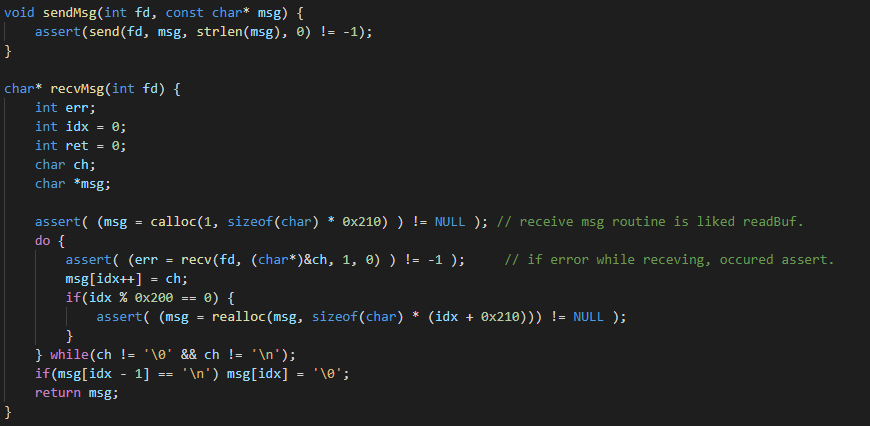

# Multi-Threaded_Chat-Application
Develop the Chat Application multithreaded
## Abstract

Raw CLI chatting application for C language socket API practice.

## Envirment
### OS & Kernel

### GCC 

### GNU Make

## Build
### make
* Change directory to root `(Multi-Threaded_Chat-Application directory)`
* Just type `make`

### remove (make clean)
* Change directory to root `(Multi-Threaded_Chat-Application directory)`
* Just type `make clean`

## Explain the details
### File structure

* `bin`: executable binary.
* `img`: report images.
* `include`: header and backend function source file. (After build, then object file exist too.)
* `src`: main(frontend) source file. (After build, then object file exist too.)

## Source
모든 소스에서 에러에 강력하게 대응하여 assertion을 발생시킨다.
### Chat source
#### include/chat.h

 

`client`와 `server`에서 사용하는 모든 헤더를 미리 선언하였고, 공통으로 사용되는 함수들에 대한 선언이 존재한다.

또 별도로 서버단에서 수용할 수 있는 client의 최대 크기를 저장하는 macro와 pthread의 자원 경쟁 상태(race condition)취약점을 방지하기 위한 pthread `mutex`도 존재한다.

또, 자료형을 보기 편하게 새로 정의했다.

##### setup()

 

File stream clean up.

##### readBuf()

 

Get the input message string.
무한정 입력을 받기 위해, 1byte씩 입력을 받다가 일정 크기 이상의 입력을 받게되었다면 공간을 재할당하고 `read`함수를 통해 입력을 계속 받는다.
개행이나 NULL byte가 입력될 때까지 반복하고, 무조건 문자열의 마지막이 `'\n\0'`이 되도록 구성한다.
`read`함수는 기본적으로 `int read(int fd, void *buf, size_t count);`의 형태로 구성이 되어있다.
1번째 인자에 파일 디스크립터(여기서는 `0`, `stdin`의 fd), 2번째 인자에는 버퍼의 주소, 3번째 인자에는 입력받을 길이를 넘겨받는다. 
`read`함수는 넘겨받은 `fd`의 파일로부터 `count`만큼 `buf`에 입력을 받는 함수다. 함수가 성공적으로 작동하면 입력받은 길이를, 실패한다면 error number를 반환한다.

##### sendMsg() & recvMsg()

`sendMsg`
`send`라는 TCP/IP 통신 API를 통해 입력받은 `msg`를 전송한다.    
`send`함수는 기본적으로 `ssize_t send(int sockfd, const void *buf, size_t len, int flags);`의 형태로 함수 형식이 구현되어있다.
첫 번째 인자로 받아오는 `sockfd`에 연결된 소켓에 `buf`를 `len`만큼 tcp/ip protocol을 통해 전송한다. `flag`값은 송신 방식을 설정한다.

`recvMsg`
`recv`라는 TCP/IP 통신 API를 통해 `msg`를 전송받는다.
`recv`함수는 기본적으로 `ssize_t recv(int sockfd, void *buf, size_t len, int flags);`의 형태로 함수 형식이 구현되어있다.
첫 번째 인자로 받아오는 `sockfd`에 연결된 소켓에서 입력을 `buf`에 `len`만큼 tcp/ip protocol을 통해 받아온다. `flag`값은 수신 방식을 설정한다.
이 과정에서 받는 `msg`의 크기 제한이 없도록 `readBuf`의 루틴을 참조한다.
이후에는 받아온 msg를 반환한다.

### Server source
#### include/server.h

 

`DISCONNECT_STR`는 클라이언트의 연결이 종료됐을 때, 연결 종료를 알리기 위한 `string`을 사전에 정의해놓은 macro다.

또, `client`와 `sender`라는 구조체를 생성한다.
client구조체는 각각 연결될 5개의 클라이언트 정보를 저장하기 위해 존재하고, sender구조체는 받아온 메시지를 전 소켓에 다 전송하기 위해 받아온 메시지에 대한 정보(sender fd, sender name, message value, used)를 저장하기 위해 존재한다.

#### include/server.c
##### validateArgv(int argc, const char* argv[])

 

서버 바이너리 인자의 유효성을 검증하는 함수다. 유효성 검증에 실패하면, 1을 반환한다.
자세한 설명은 생략하겠다.
##### getPort(int argc, const char* argv[])

 

앞에 설명한 `validateArgv`를 통해 인자의 유효성을 검증한 뒤, `strtoull`함수로 port값을 int로 변환하여 반환한다.
##### void printAddrInfo(struct sockaddr_in *addr)

 

`sockaddr_in`구조체 포인터를 인자로 넘겨받고, 해당 인자 값의 정보를 출력한다.
`inet_ntop`함수는 `addr->sin_addr`에 저장된 ip address의 값을 string으로 변환해준다.
##### int connectSocket(int port) 

 

전체적인 루틴은 다음과 같다.
**만약 전역변수 `SOCKFD`에 값이 존재한다면,**
* socket 생성
* 지정된 정보로 addr 정보 할당
* `bind` API를 통해서 addr변수 값을 생성된 socket에 적용
* `listen` API를 통해서 socket을 `passive opening` 상태로 변경 (외부 연결 허용 -> tcp 3-way handshake과정을 (`syn` -> `syn, ack` -> `ack`) 모두 처리한다.)
* 전역변수 `SOCKFD`에 생성된 socket fd 할당.
* `accpet` API를 통해, 연결을 수신받았을 경우, 실제로 연결을 용인. (passive open 상태였을 경우에는 연결 수립 및 메시지 수신을 했을 경우 queue에 저장해놓지만 accept된 이후에는 queue에 담긴 것들을 모두 꺼내와서 communication을 진행한다.)
* 최종적으로 연결이 수립된 client에 대한 정보 출력

**만약 `SOCKFD`가 이미 값이 할당되었다면,**
* 위의 모든 과정을 생략하고 `accept` 과정만 진행한다. (어처피 이미 socket은 `passive open` 상태일 것이므로)

#### src/server.c
##### void exitHdlr(int sig)

 

핸들러 함수 이전에 send 및 recv routine함수에 대한 선언이 존재하며, 앞서 설명한 두 구조체의 전역변수 선언이 존재한다. `CLIENTS`배열은 `CLIENT_MAX` 만큼의 사이즈를 갖는다.
이하 핸들러는 만약 강제적으로 종료가 되었을 경우 처리를 위한 `signal handler`다.
타 쓰레드에서 공통으로 사용하는 자원인 `CLIENTS`, `SENDER` 전역변수의 사용이 존재하기 때문에 mutex lock을 진행하여 race condition을 예방하였고, lock이 걸린 이후에는 모든 열린 CLIENT socket을 닫고 힙에 저장된 이름값을 해제한 뒤 mutex unlock을 진행하며, 최종적으로 이용 종료 문구 출력 후 `exit`함수를 통해 바이너리가 종료된다.

**이하에 존재하는 pthread_mutex_lock 및 unlock 함수의 사용은 모두 `critical section`에 접근을 방지하기 위해서라는 같은 목적을 위해 존재하기 때문에 설명을 생략하겠다. 또한, mutex lock 및 unlock은 아무 곳에서나 남용하지 않았다.**
##### main

구현된 함수들(이하 설명)을 통해 구현됐다.
먼저, 추후에 무한 반복을 진행할 것이기 때문에, 강제종료를 통한 Interrupt이나 abort가 발생할 경우를 처리하기 위한 signal 처리를 선언했다.
또, `recvRuntine`과 `sendRutine`을 작동할 쓰레드를 생성하기 위한 쓰레드 변수를 선언한다.
`recvRutine` 경우 각 (최대 5개의)소켓 네트워크마다 모두의 입력을 받아와야하기 때문에 쓰레드 사이즈 5의 배열을 선언했다.
그 이후에 인자를 통해 port를 받아오고, `sendRoutine`을 실행하는 쓰레드를 생성한다.

이후 무한반복 루프를 통해 받아온 port를 통해 socket을 형성 및 연결을 수용하고 client정보를 전역변수에 저장하며, 각 client 소켓마다 `recvRoutine` 쓰레드를 생성한다.
이 과정은 강제로 종료하기 전까지 무한 반복된다.

##### void *sendRoutine(void *a)

 

무한 루프를 도는 쓰레드 루틴인데, 만약 `SENDER`의 `used`멤버 변수가 set 되어있다면, 앞서 설명한 `sendMsg`함수를 통해 SENDER를 제외한 모든 열린 socket에게 SENDER의 buffer를 전송한다. 
다만 만약 SENDER 소켓의 `DISCONNECT`를 알리는 경우에는 내부 전송 과정만 조금 다르다.
이후에 모든 전송이 끝났다면 server에게도 printf로 똑같은 메시지를 출력하며, 사용된 buffer를 모두 free시키고 pointer는 NULL로 값을 재할당한다.

##### void *recvRoutine(void *arg)

 

5개의 쓰레드가 동시에 무한 루프를 도는 루틴인데, 만약 한 socket이라도 `recvMsg`함수를 통해 message를 받아왔다면, 다음과 같은 루틴을 진행한다.

**만일 받아온 client에 이름이 존재하지 않는다면,**
* 받아온 메시지를 strdup를 통해 새로 힙에 할당하여 전역변수에 저장하고
* 해당 클라이언트의 연결을 서버에 출력한다
* 이후 열린 모든 클라이언트에게도 연결 수립을 알린다.

**만약 이름이 이미 존재한다면,**
* 받아온 메시지에 대한 모든 정보를 SENDER에 할당하고
* `sendRoutine`이 정상적으로 모든 클라이언트에게 SENDER의 정보를 전달할 수 있도록 전역변수 값을 set한다.
* 만약 연결 종료를 알리는 `QUIT` 메시지일 경우에는 모든 CLIENT의 정보를 처음으로 초기화하며 할당된 힙도 해제한다. 

모든 루틴이 종료되었을 경우 입력받은 message를 종료하고 다시 처음으로 돌아가 루틴을 재시작한다.

### Client source
#### include/client.h

 

client에서 사용되는 함수들을 미리 선언해놨다.
#### include/client.c
##### int validateArgv(int argc, const char* argv[])

 

앞서 설명한 server의 validator의 모든 루틴과 거의 유사하다. 자세한 설명은 생략한다.

##### const char* getIP(const char* argv[]) && int getPort(const char* argv[])

 

넘겨받은 인자를 함수 기능에 알맞게, 값을 반환하도록 구현되어있다.

##### int connectSocket(const char* ip, int port)

 

먼저 addr의 `family`를 설정하고, `inet_pton` API를 통해 addr에 IP 주소를 삽입한다.
이후 addr.sin_port 변수에 port값을 `htons` API를 통해 big endian으로 변환하여 저장하고, 소켓 생성 및 `connect`를 진행한다.
이 때, `connect`과정에서 3-way handshake 과정 중 하나인 `syn` packet 보내기 및 `syn, ack`패킷 전송받기, `ack`패킷 재전송이 모두 이뤄진다.
성공적으로 socket 생성 및 연결이 진행됐다면 socket fd를 반환한다.

#### src/client.c
##### handlers

 

모든 쓰레드에서 사용될 socket의 `FD`와, loop 동작의 여부를 판단하는 `L`, 그리고 client의 이름을 저장하는 `NICKNAME` 전역변수 세 개가 선언되어있다.
그 밑에는 각 핸들러가 선언되어있는데, `abort`의 경우 연결 수립 실패이므로 연결 실패에 대한 알림을 출력하고, `interrupt`의 경우 강제종료이므로, 모든 종료 루틴을 따를 수 있도록 handling한 이후 바이너리가 종료된다.

##### void *sendRoutine(void *a)

 

`L` 변수로 종료 여부를 판단하여 L 변수가 unset 될 때까지 무한 루프를 돌고, `readBuf`함수를 통해 message를 입력받는다.
입력받은 message를 서버 소켓에 전송한다.
만일 입력받은 message가 종료를 의미하는 `QUIT`일 경우, 메시지를 출력한 뒤 L 변수를 0으로 set하여, 서버와 연결 종료 및 바이너리 종료를 진행한다.

##### void *recvRoutine(void *a)

 

`L` 변수로 종료 여부를 판단하여 L 변수가 unset 될 때까지 무한 루프를 돌며 recvMsg 함수를 진행한다.
recvMsg 함수로 받아온 message를 단순히 출력하는 것이 전부다. 

##### int main(int argc, const char* argv[])

setup함수를 호출하여  file stream을 정리하고, signal 함수를 통해 `ABORT`와 `INTERRUPT`를 핸들링한다.
이후 인자를 통해 ip, port를 get하고, 넘겨받은 NICKNAME을 힙으로 재할당하여 전역변수에 저장한다.
이후에 NICKNAME을 서버에게 전송하고, 연결 수립을 스스로 출력한 뒤 `L` 전역변수를 set하고 이전에 설명한 쓰레드를 각각 실행시킨다.
이후에 join을 통해 sendThread의 종료를 대기하는데, 이는 서버와의 연결의 종료를 의미한다. 
sendThread가 연결 종료되었다면, recvThread도 강제로 종료시키고, `server FD`닫기 및, NICKNAME 힙 공간 해제를 진행한다.

## Execution
### Screenshot dump

 

connection이 성공할 경우, (3-way handshake) 서버는 클라이언트의 정보를 출력하고 대화를 중개한다.
각 클라이언트 역시 새로 연결된 유저의 연결을 확인할 수 있고, 각자 연결 이후 대화를 진행할 수 있다.

 

`QUIT`를 입력하자 종료되는 것을 확인할 수 있다.
또 이전 스크린샷을 확인하면, 종료 정보 또한 모든 클라이언트와 서버에 출력됨을 알 수 있다.